# CLUES - Architecture

## System Overview

The Acute Stroke Patient Classification System is a modular system that analyzes medical imaging reports to classify patients. This system integrates Zero-Shot learning, Few-Shot learning, RAG (Retrieval-Augmented Generation), and ensemble techniques to achieve accurate patient classification.

## Main Module Flow

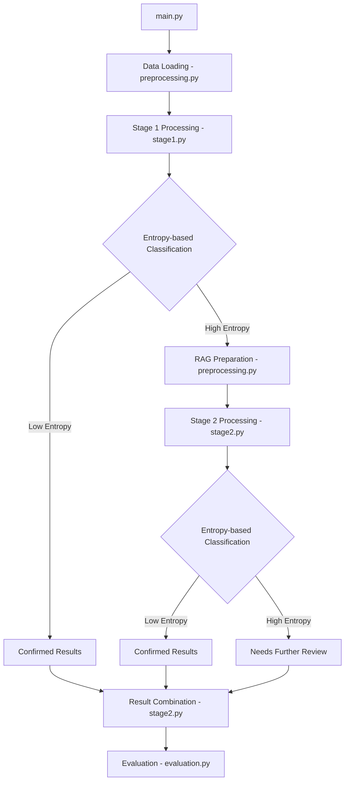

## Detailed Module Architecture

### 1. Data Processing Pipeline

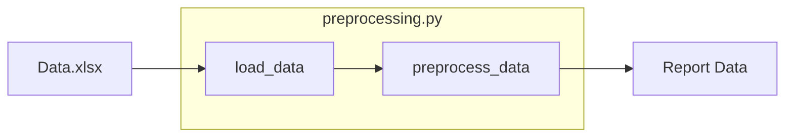

### 2. Stage 1: Zero-Shot + Ensemble Processing

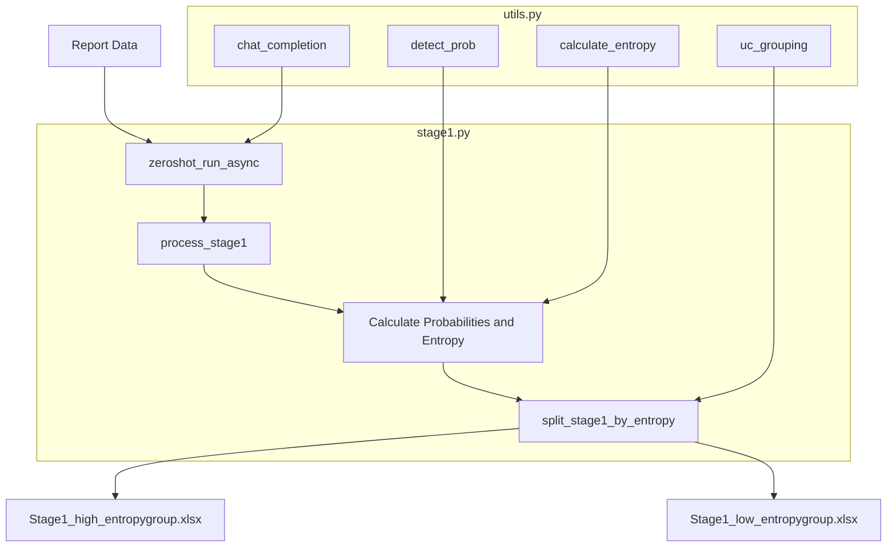

### 3. RAG Dataset Preparation

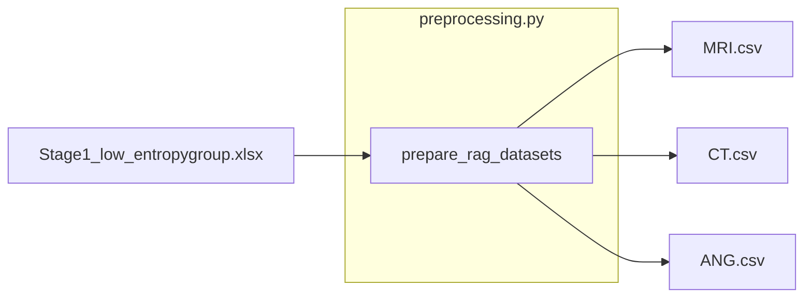

### 4. Stage 2: Few-Shot + RAG Processing

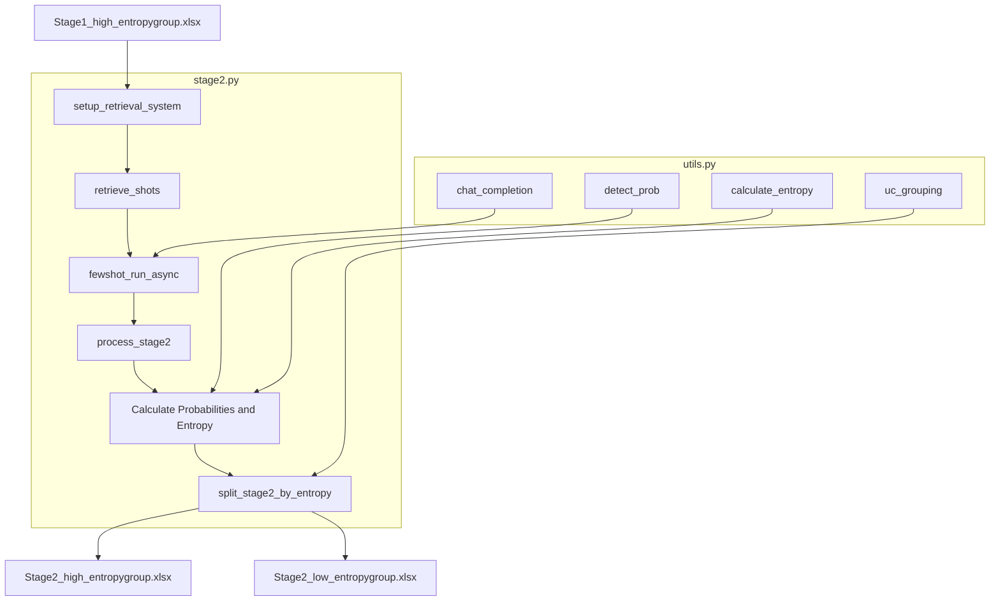

### 5. Result Combination

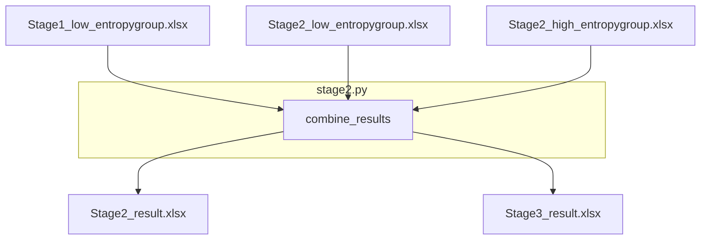

### 6. Evaluation System

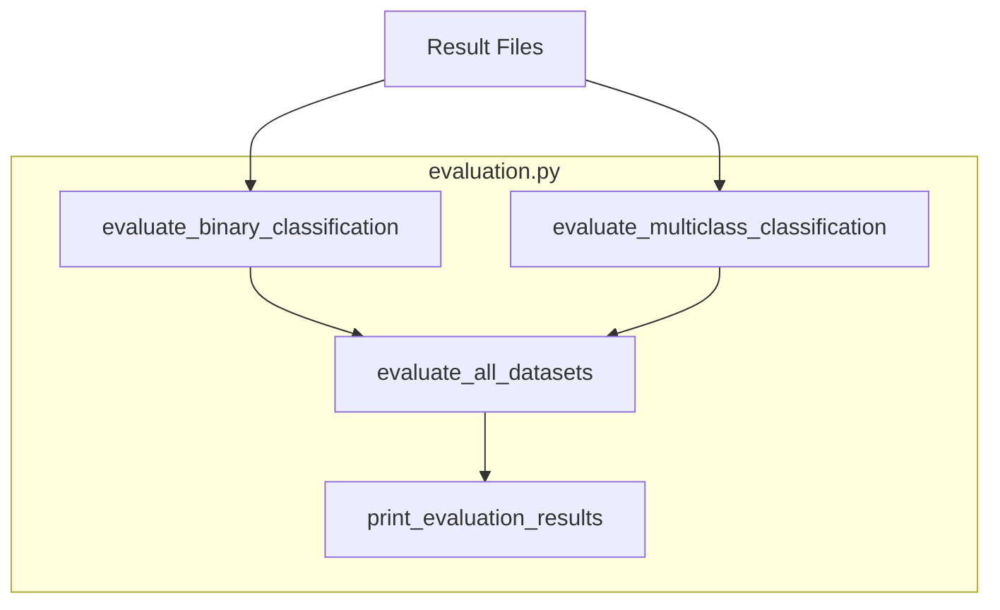

### 7. Overall System Operation

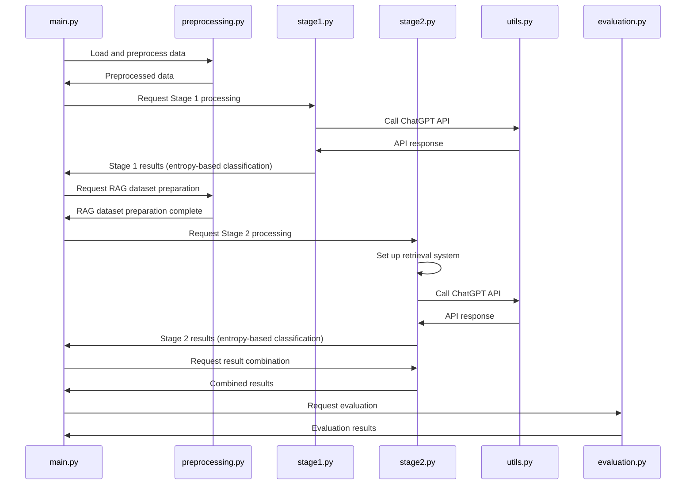

## Technical Implementation Details

### OpenAI API Call Implementation

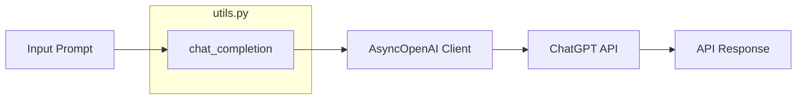

### Entropy-based Uncertainty Classification

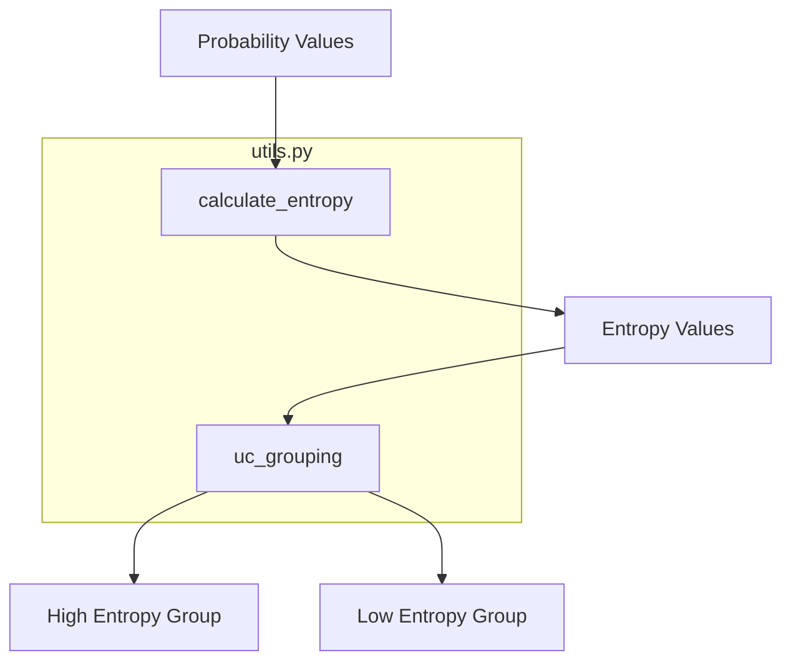

### RAG System Implementation

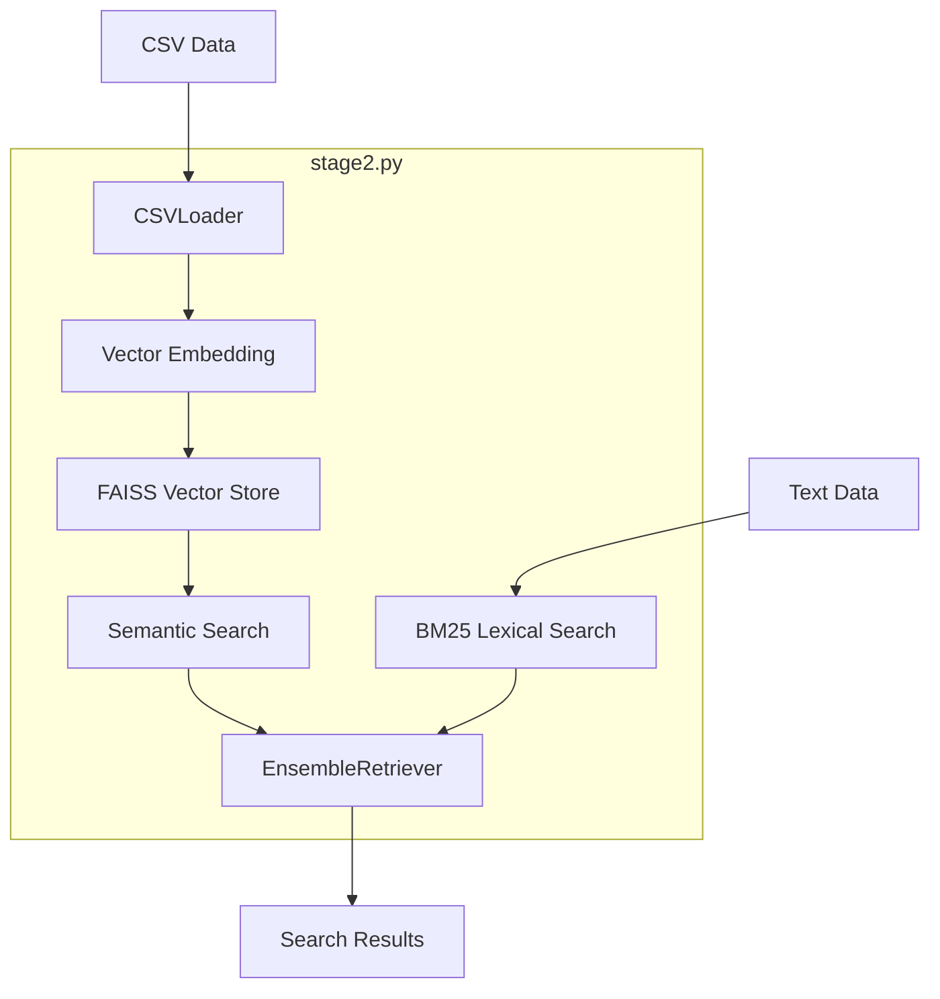
